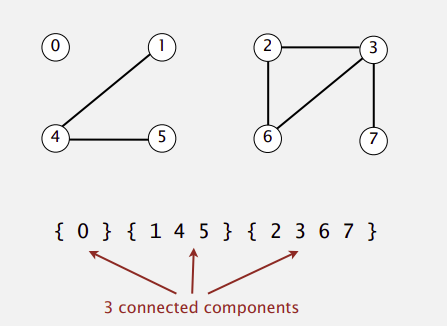

# Dynamic Connectivity Problem

Given a set of n elements:

## Union Command
- **Union command**: Connect two objects.
- **Find**: Determine whether there is a path connecting two objects using reflexive, symmetric, or transitive properties.

## Demonstration of Dynamic connectivity | Modelling the connections
If I have 3 objects `p`, `q`, `r`, are they connected?
1. **Reflexive**: `p` is directly connected to `p`.
2. **Symmetric**: If `p` is connected to `q`, then `q` is connected to `p`.
3. **Transitive**: If `p` is connected to `q` and `q` is connected to `r`, then `p` is connected to `r`.

    
<h3>Example of maximum set of mutually connected objects</h3>

    

    
<h3>Example Question</h3>

    

  
<h3>Real-World Applications | Modelling of the objects</h3>

Dynamic connectivity can be applied in various real-world applications, including:

| Application Domain                       | Examples                                                 |
|------------------------------------------|----------------------------------------------------------|
| **Network Connectivity**                 | - Computer Networks - Social Networks                 |
| **Image Processing**                     | - Segmentation - Object Recognition                   |
| **Percolation Theory**                   | - Material Science - Epidemiology                     |
| **Graph Algorithms**                     | - Minimum Spanning Trees - Cycle Detection            |
| **Database Management**                  | - Equivalence Queries - Partition Management          |
| **Physics and Chemistry**                | - Cluster Analysis - Phase Transitions                |
| **Geographic Information Systems (GIS)** | - Routing and Navigation - Land Management            |
| **Game Development**                     | - Pathfinding - Region Management                     |
| **Software Engineering**                 | - Version Control Systems - Dynamic Memory Management |
| **Distributed Systems**                  | - Resource Allocation                                    |

### Operations | DATA STRUCTURE TO SOLVE DYNAMIC CONNECTIVITY
- Using [quick-find]()